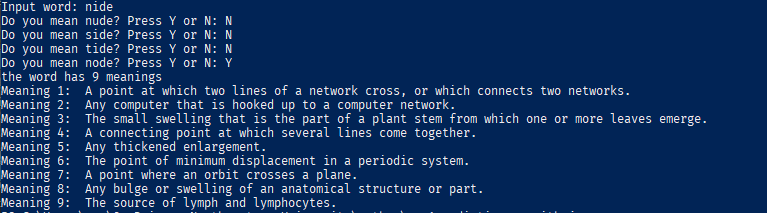

# Dictionary By Python
This app looks for any English word and returns its meaning(s)  
There is a JSON file that contains all the English words.  
** run the app by running the file `app1.py` **

---
if the word could not be found in the dict, it suggests the similar words:

