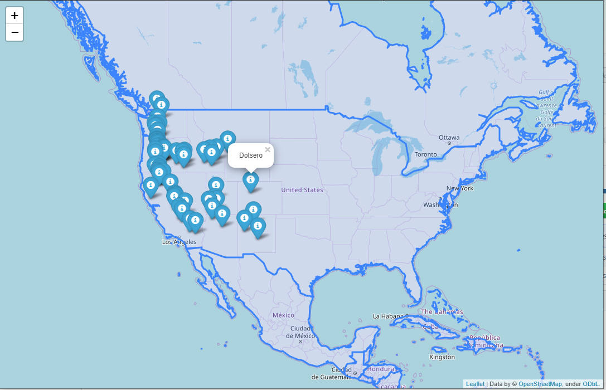

# Labeling volcanoes on a map
This app locates US volcanoes on the map using folium library.  
** run the app by running the file `app2.py` **  
**and then open `maps.html`**  

there are two files:  
- `volcanoes.txt` : a table of (x,y) locations and name of vlocanoes  
- `world.json` : information about countries and borders

---
an screenshot of the output generated map

