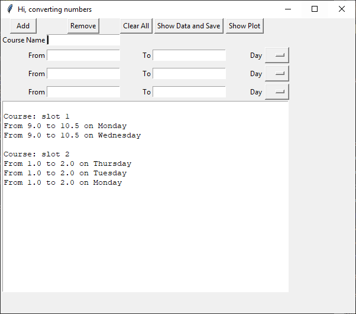
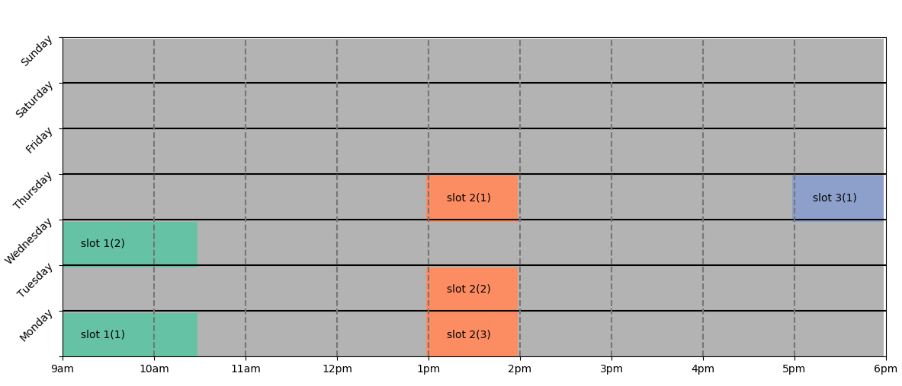

# Creating a weekly schedule with Python

The app has a GUI windows to get, show, and display information from/to the user.

following image shows the GUI windows:

Once all the data has been added, click on `Show Plot` to display the weekly schedule.

---

## How to run the app:
run `python window.py`

**Note:**
*You need Tkinter package to run succeesfully*
