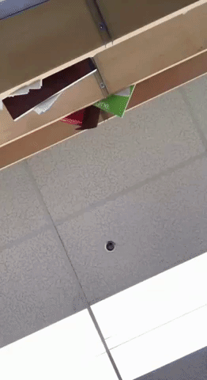

## Motion Detection Using OpenCV

This app captures a video and detection the any motion in the video.  
*a green box will be sketched around the moving object*  
The moving object is detected by comparing the current frame with the previous frame.

---

   
the pixels in which a motion is detected are in white *[left]*   
the boxes shows the moving object *[right]*