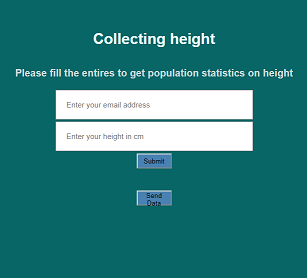
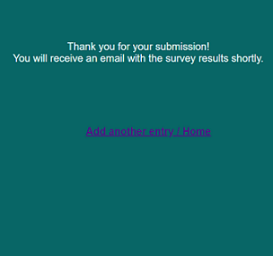

## getting email address and height from the user
This app gets some data from the user and sends the data through email 

Following photo shows the form for inserting data

  

after inserting the email and height, a message will be shown, indicating successfully submitting the data.   

  
 
 ---

 by clicking in `Send Data` button, the user should insert the email credentionals and an email to send the data to in `Terminal`  

## How to run the app:   
 `python front_end.py`